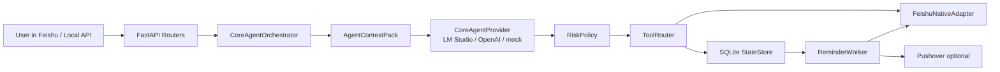
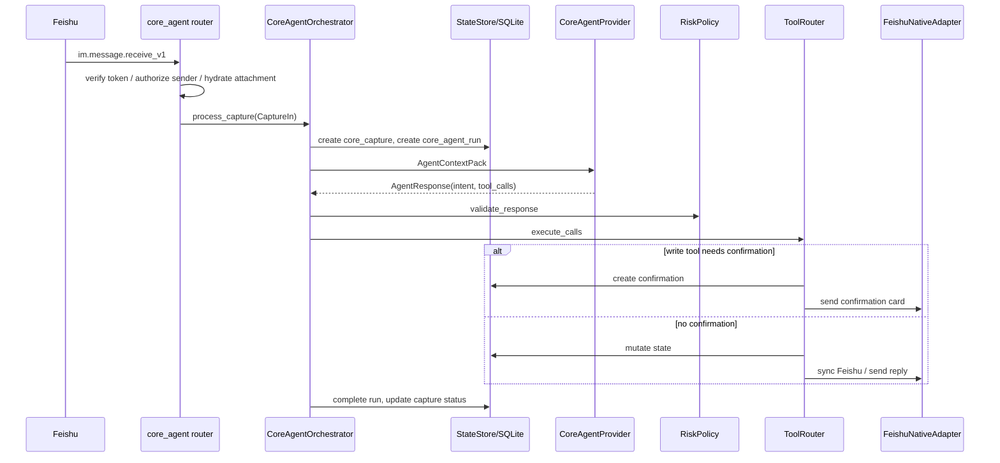

# 架构总览

## 高层组件

## 主要运行入口

| 入口 | 文件 | 说明 |
| --- | --- | --- |
| FastAPI app | `app/main.py` | 创建应用、迁移数据库、注册路由、健康检查 |
| v2 本地消息 | `app/routers/core_agent.py` `POST /api/v2/agent/messages` | 本地调试入口 |
| v2 飞书消息 | `app/routers/core_agent.py` `POST /api/v2/feishu/events` | 当前主要飞书事件入口 |
| v2 飞书卡片回调 | `app/routers/core_agent.py` `POST /api/v2/feishu/card` | 确认卡、提醒卡、每日汇总卡动作 |
| reminder worker | `app/workers/reminder_worker.py` | 轮询 due item、固定安排、每日汇总 |
| legacy 飞书入口 | `app/routers/feishu.py` | 早期 agent stack 入口，仍保留 |

当前路由摘要见 [ROUTES](../artifacts/ROUTES.txt)。

## 当前主路径

## 代码责任边界

| 模块 | 职责 |
| --- | --- |
| `app/core/schemas.py` | v2 领域对象、agent response、tool name、状态枚举 |
| `app/core/store.py` | v2 SQLite tables、CRUD、轻量迁移 |
| `app/core/context_builder.py` | 构建压缩后的 `AgentContextPack`，避免把大上下文直接丢给模型 |
| `app/core/providers.py` | 模型适配、intent 归一、二阶段实体抽取、启发式兜底 |
| `app/core/policy.py` | 查询/写入安全约束、确认要求归一化 |
| `app/core/tools.py` | tool call 执行、确认卡生成/解析、计划/习惯/课程表排程 |
| `app/core/feishu_native.py` | v2 对飞书发送、同步、卡片 payload 的抽象 |
| `app/adapters/feishu_client.py` | 飞书 OpenAPI 具体 HTTP 封装和 payload 转换 |
| `app/workers/reminder_worker.py` | 提醒、预强提醒、强提醒、每日汇总、重排/取消回调 |

## 设计原则

- 本地 SQLite 是事实源，飞书是入口和动作层。
- 模型只负责理解和结构化，不直接操作数据库。
- 写操作默认需要确认；查询不能携带写工具。
- 长期计划先进入草案层，再生成确认卡，再写日历。
- 附件和图片可以进入模型上下文，但不可被当作确认/取消消息。
- 对飞书失败采用本地先提交、同步结果记录/降级的方式，避免状态丢失。

## 当前架构张力

- v2 和 legacy 两套模型并存，后续需要明确淘汰边界。
- ToolRouter 已经承载大量业务流程，需要拆分为 `task_tools`、`calendar_tools`、`plan_tools`、`confirmation_tools`。
- Provider 层混合了 prompt、规则兜底、二阶段实体抽取和业务防错，建议拆为 classifier、entity extractor、backend guard。
- SQLite 手写迁移能支撑原型，但不适合多人长期迭代。

