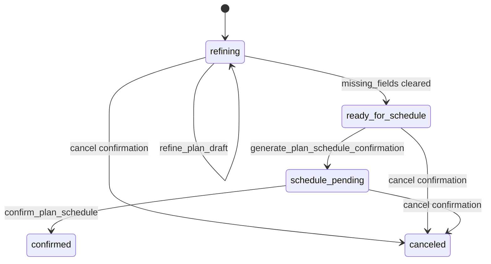

# AI Agent 运行时

## Agent contract

v2 agent 的核心契约是：

```text
CaptureIn -> AgentContextPack -> ModelIntent/AgentResponse -> RiskPolicy -> ToolRouter -> StateStore/Feishu
```

模型输出不能直接写数据库。后端只接受受控 `ToolName`，并由 `RiskPolicy` 和 `ToolRouter` 决定是否需要确认。

主要 schema：

- `AgentIntent`: `query_today`, `query_tomorrow`, `query_week`, `query_availability`, `create_candidates`, `update_existing`, `complete_item`, `schedule_blocks`, `smalltalk`, `unknown`
- `ToolName`: 覆盖任务、日程、固定安排、确认、长期计划、习惯、课程表导入、查询、同步和审计
- `RiskLevel`: `low`, `medium`, `high`

## Provider 层

`app/core/providers.py` 当前支持：

- `MockAgentProvider`: 测试和本地规则 fallback。
- `LmStudioProvider`: 本地 LM Studio 兼容 OpenAI API，支持图片作为多模态 part。
- `OpenAIApiProvider`: OpenAI API 兼容 provider。
- `LocalMultimodalProvider`: 本地多模态 provider 占位/适配。
- `CodexCliProvider`: Codex CLI 风格 provider。

Provider 的职责不是执行工具，而是：

1. 第一阶段判断 intent。
2. 对需要结构化字段的 intent 做第二阶段 entity extraction。
3. 对高风险/易错场景做 backend guard，例如：
   - 课程表图片不能误判为长期学习任务。
   - 图片-only 不能确认或取消待确认卡。
   - “固定安排不用提醒”不能走取消固定安排。
   - 低置信度时只追问，不写状态。

## 风险策略

`RiskPolicy` 做两类约束：

- 查询 intent 不能调用写工具。
- `unknown` intent 只能发送文字或手动确认卡，不能写状态。

同时，`ALWAYS_CONFIRM` 会强制以下工具生成确认卡：

- 创建任务候选
- 创建日程候选
- 确认长期计划日程
- 更新/取消任务
- 更新/取消日程
- 创建固定安排
- 习惯排程
- 更新固定安排

例外：`disable_schedule_block_reminders` 是低风险偏好更新，目前不强制确认；它只关闭固定安排提醒，不删除日程、不取消飞书日历。

## PlanDraft 状态机

`PlanDraft` 是当前解决“长期但不清晰”需求的中间层。



支持 kind：

- `habit`: 例如“我想锻炼身体，保持健康”。
- `course_timetable`: 课程表图片导入。
- `long_term_schedule`: 其他长期日程。

关键行为：

- 模糊目标先生成草案卡，缺字段就追问。
- 草案完整后才生成日程确认卡。
- 确认前不写正式任务/日历。
- 课程表保留结构化事实源，再生成具体日历事件。

## 课程表导入策略

课程表图片和“现在第 13 周”这类消息走 `course_timetable` 草案，不走 `schedule_time_budget_plan`。

目标 payload：

- `period_map`: 节次到起止时间。
- `term_anchor`: 当前教学周、消息日期、推断第一周周一、是否需要确认。
- `courses[]`: 课程名、星期、节次、周次范围、地点、老师、班级、证据文本、置信度。

当前 v1 策略：

- 复用本地多模态模型抽结构。
- 置信度低或字段缺失时澄清，不强行写日历。
- 后续可接独立 OCR/table parser 服务。

## 习惯养成策略

习惯流程保留旧工具名兼容，但内部逐步迁移到通用 `PlanDraft`：

1. 用户给模糊目标。
2. 系统生成养成草案卡并追问细节。
3. 用户补充方式、频率、时间窗、周期。
4. 系统生成日程确认卡。
5. 用户确认后写日历事件。

## 需要审查的 agent 问题

- Provider 中规则兜底和业务策略是否应拆成独立 backend classifier。
- ToolName 是否需要版本化，例如 `tool_schema_version`。
- 复杂计划是否应该从 ToolRouter 拆成 Planner service。
- 对模型输出的 JSON schema 校验是否足够严格。
- 低置信度/多模态失败时的追问策略是否需要统一模板。

