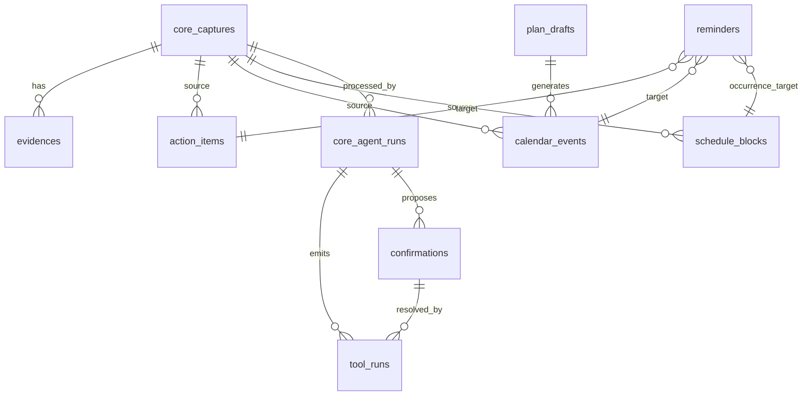

# 数据模型

## 数据源分层

当前 SQLite 同时承载 legacy 和 v2 数据。

v2 主表：

- `core_captures`
- `evidences`
- `action_items`
- `calendar_events`
- `schedule_blocks`
- `reminders`
- `confirmations`
- `plan_drafts`
- `core_agent_runs`
- `tool_runs`

legacy 主表：

- `captures`
- `actions`
- `agent_runs`
- `review_jobs`
- `sync_events`

通用实体表：

- `projects`
- `persons`
- `commitments`
- `waiting_for`

完整 schema 摘要见 [SCHEMA_SUMMARY](../artifacts/SCHEMA_SUMMARY.md)。

## 核心实体关系

## 关键字段

### `core_captures`

保存用户输入原始证据：

- `source`, `source_message_id`, `source_event_id`
- `sender_id`, `chat_id`
- `content_type`, `raw_text`
- `attachment_refs`
- `received_at`, `processed_status`

用途：

- 幂等：同一 source/message_id 不重复处理。
- 回溯：任务、日程、计划都能追到来源。
- 附件：图片下载后以 local_path/mime/size 放到 attachment refs。

### `action_items`

任务型事项：

- `title`, `description`, `status`, `priority`
- `due_at`, `estimated_minutes`
- `project_id`, `person_id`, `source_capture_id`
- `confidence`

### `calendar_events`

具体日历事件：

- `title`, `description`, `start_at`, `end_at`, `location`
- `feishu_event_id`
- `plan_draft_id`, `plan_item_id`
- `source_capture_id`, `confidence`

`plan_draft_id` 和 `plan_item_id` 是课程表/习惯计划反向追踪的关键。后续修改课程表时，应按这些字段重建或取消相关事件。

### `schedule_blocks`

固定重复安排，通常表示每周固定占用或固定课程。

- `title`
- `recurrence_rule`: 当前主要用 `FREQ=WEEKLY;BYDAY=...`
- `start_time`, `end_time`, `timezone`
- `feishu_event_id`
- `reminder_enabled`

`reminder_enabled=False` 表示仍参与查询、空闲计算和日历同步，但不触发 3 分钟提醒卡或到点强提醒。

### `confirmations`

确认卡状态：

- `confirmation_type`
- `proposed_tool_calls_json`
- `status`: pending/resolved/expired/canceled
- `expires_at`, `feishu_card_id`, `sender_id`

设计意图：

- 用户确认前不执行写工具。
- 卡片回调和文字“确认/取消”都回到同一状态机。
- 过期确认不会执行。

### `plan_drafts`

长期计划草案：

- `kind`: habit/course_timetable/long_term_schedule
- `status`: refining/ready_for_schedule/schedule_pending/confirmed/canceled
- `payload_json`
- `missing_fields_json`
- `source_capture_id`, `sender_id`, `confidence`

## 当前运行计数

截至 2026-06-02 本地运行库迁移后：

| 表 | 数量 |
| --- | ---: |
| `core_captures` | 79 |
| `action_items` | 4 |
| `calendar_events` | 25 |
| `schedule_blocks` | 12 |
| `plan_drafts` | 1 |
| `confirmations` | 19 |
| `reminders` | 46 |
| `core_agent_runs` | 79 |
| `tool_runs` | 81 |

这些是数量，不包含真实内容。

## 数据模型风险

- 缺正式迁移版本表，`ALTER TABLE` 以 suppress exception 方式追加字段。
- `reminders.target_type/target_id/channel` 是灵活模型，但没有唯一索引，幂等依赖代码查询。
- `schedule_blocks.recurrence_rule` 仅解析 BYDAY，未完整实现 RFC5545。
- 计划草案 payload 是 JSON，灵活但缺强 schema。建议引入 per-kind payload validator。
- legacy 与 v2 表共存，审查时需要决定是否迁移 legacy 数据并删除旧路径。

