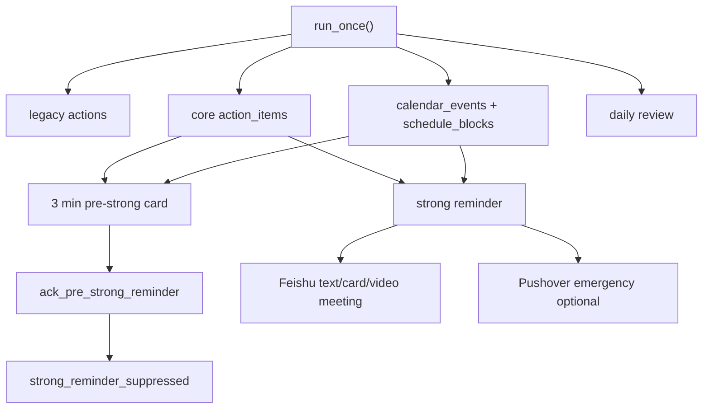

# 飞书与提醒系统

## 飞书集成边界

飞书承担四个角色：

1. 入口：私聊或群聊 mention 机器人。
2. 确认：发送交互卡片，用户点击确认/取消/知道了/重排。
3. 行动层：同步任务、日历、固定安排。
4. 反馈层：提醒、强提醒、每日汇总。

v2 入口在 `app/routers/core_agent.py`：

- `POST /api/v2/feishu/events`
- `POST /api/v2/feishu/card`

legacy 入口在 `app/routers/feishu.py`：

- `POST /api/feishu/events`

## 消息安全

路由层做：

- URL verification challenge。
- event verification token 校验。
- open_id/user_id/union_id 授权白名单。
- 群聊需要 mention 才处理。
- 附件下载后保存到本地 attachment storage，并只把 refs 传入 agent。

`PublicTunnelProtectionMiddleware` 会保护公开 tunnel 下的 `/docs` 等本地管理入口。`/health` 保持可访问。

## 飞书适配层

| 层 | 文件 | 职责 |
| --- | --- | --- |
| Native adapter | `app/core/feishu_native.py` | v2 抽象接口、mock adapter、OpenAPI adapter |
| HTTP client | `app/adapters/feishu_client.py` | tenant token、消息、任务、日历、多维表格、会议等具体 API |
| Sync service | `app/services/sync_service.py` | legacy 同步路径 |

当前飞书同步模式由 `FEISHU_SYNC_MODE` 控制，本地实际状态为 `bitable`。

## 确认卡

确认卡由 `ToolRouter` 创建：

1. `RiskPolicy.normalize_call` 将写操作标记为需要确认。
2. `ToolRouter.execute_calls` 生成 `confirmations` row。
3. `confirmation_card` 生成飞书卡。
4. 用户点击卡片或回复“确认”。
5. `resolve_confirmation` 执行原始 proposed tool calls。

关键防护：

- attachment-only 消息不能确认或取消。
- 已过期确认不会执行。
- 重复确认不会重复创建。

## 提醒 worker

`app/workers/reminder_worker.py` 轮询执行：

- legacy action reminders。
- v2 action item reminders。
- calendar event reminders。
- schedule block occurrence reminders。
- daily review summary and follow-up。

## 强提醒设计

默认提前 3 分钟发送“提醒确认”卡：

- 用户点击“知道了”后，本次强提醒取消。
- 若未确认，到点触发强提醒。
- 强提醒模式可配置为视频会议或文本降级。
- Pushover emergency 可作为额外通道。

对固定安排的最新改动：

- `schedule_blocks.reminder_enabled=True` 默认开启。
- 用户可说“以后每周固定的安排不用提醒我了”。
- 系统调用 `disable_schedule_block_reminders`，只关闭提醒，不取消日程。
- worker 对 `reminder_enabled=False` 的固定安排跳过预强提醒和强提醒。
- 固定安排仍参与每日查询、空闲计算和飞书日历同步。

## 每日汇总

晨间汇总展示：

- 逾期任务
- 今天任务
- 今日日程
- 固定安排
- 待确认
- 未排期任务

近期修复：

- 过期待确认会被过滤并标记 expired。
- 待确认显示友好标题，而不是 `schedule_blocks | conf_xxx` 这类内部类型。
- 用户确认今日汇总后，当天不会再触发 2 小时强跟进。

## 提醒系统审查点

- `reminders` 表缺唯一约束，建议对 `(target_type,target_id,channel)` 建唯一索引。
- 轮询 worker 多进程运行时需要确认不会重复发送。当前进程列表显示 uvicorn/worker 各有 launcher/child 两条，需要区分是否真实双 worker。
- Pushover emergency 的 retry cancel 与 Feishu ack 之间需要端到端测试。
- schedule block occurrence 的 target_id 使用 `block_id:YYYY-MM-DD`，适合单日幂等，但后续跨时区/跨日 recurrence 要谨慎。

