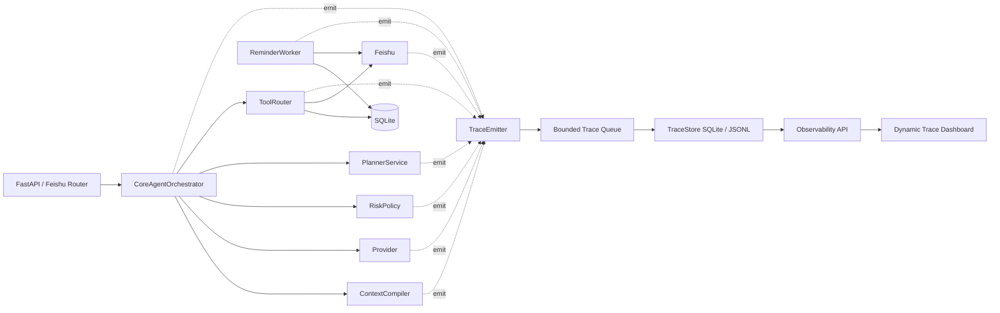

# Visual Observability / 动态流程监控架构设计草案

## 1. 目标

本设计为 Feishu Life OS 增加一个 **旁路式、动态、信息密度高、偏严肃风格** 的可视化监控框架。

它的目的不是展示模型隐藏思维链，也不是模拟真实神经网络激活，而是展示系统中已经发生、可以审计、可以回放的运行轨迹：

```text
用户消息
  -> 捕获与附件处理
  -> ContextCompiler / ContextCapsule
  -> Provider 意图与实体判断
  -> RiskPolicy 安全门
  -> PlannerService 草案与计划推进
  -> ToolRouter 执行或确认卡
  -> SQLite 状态变化
  -> 飞书同步 / 提醒 worker
```

核心定位：

> 可视化系统是架构放大镜，不是业务调度器；它只能观察、记录、回放、解释，不参与决策和写操作。

## 2. 设计风格

用户希望的视觉风格接近“动态进度条 + 高密度流程仪表盘”，而不是轻量聊天 UI。

建议风格关键词：

- 严肃、工程化、控制台感。
- 高信息密度，但分层展示。
- 动态进度条 / 多泳道 timeline / 节点状态灯。
- 支持 live view、replay view、trace compare。
- 一眼能看出卡在哪、慢在哪、谁生成了什么、哪些上下文被模型看到。

第一版不追求 3D 或复杂神经网络动画。先做准确的工程调试视图，再做演示层动画。

## 3. 不展示隐藏思维链

本项目可以展示 **observable reasoning trace**：

- 模型输入的上下文摘要。
- `context_v2` 中哪些 capsule 被生成、渲染、裁剪。
- provider 输出的 intent、confidence、reply、proposal、tool call 摘要。
- RiskPolicy 通过或拒绝的原因。
- PlannerService 如何推进 PlanDraft 状态。
- ToolRouter 创建了哪张 confirmation 或执行了哪些工具。
- 用户确认后创建或修改了哪些本地对象。

不展示也不伪造：

- 模型隐藏 chain-of-thought。
- 神经网络真实内部激活。
- 未经脱敏的完整私人消息、附件、open_id、飞书 payload。

## 4. 高层架构



关键要求：

- `TraceEmitter` 失败不能影响主链路。
- trace 写入默认异步或 best-effort。
- dashboard 只读。
- 公开 tunnel 下默认不暴露观测 UI。

## 5. 可视化主界面设计

### 5.1 Trace List

用于快速查找最近运行：

```text
[status] [time] [workflow] [duration] [provider] [intent] [risk] [capsules] [confirmation] [error]
```

示例：

```text
OK     00:31:12  feishu_message     1840ms  lm_studio  create_candidates  medium  caps=3  conf_xxx
WARN   00:34:55  feishu_message      220ms  mock       unknown            low     caps=1  needs_review
FAIL   00:38:01  reminder_worker     900ms  -          -                  -       -       feishu_sync_failed
```

### 5.2 Trace Header KPI Strip

进入单条 trace 后，顶部展示高密度摘要：

```text
trace_id      capture_id      workflow       status     duration
provider      model           intent         confidence risk_level
context_bytes capsules        confirmation   writes     feishu_sync
```

### 5.3 Multi-lane Dynamic Timeline

主视图采用多泳道时间线，每条 span 是进度条。

```text
Ingest      | █ capture.create 8ms | █ attachment.hydrate 42ms
Context     | █████ context.compile 35ms | █ render.capsules 4ms
Model       | █████████████ provider.run 1210ms
Guard       | █ risk.validate 2ms
Planner     | ███ planner.plan_response 18ms
Execute     | ██ tool_router.ask_confirmation 44ms | █ feishu.send_card 380ms
State       | █ db.create_confirmation 5ms | █ agent_run.complete 3ms
```

每个 span 使用颜色或状态标记：

- `ok`: 正常。
- `warn`: 降级、裁剪、低置信、同步失败但本地已保存。
- `blocked`: 被 policy 拦截。
- `failed`: 异常。
- `skipped`: relevance gating 跳过。

### 5.4 Context Lens

专门观察 Context Compiler：

```text
Context Compiler
  legacy_size: 8.2 KB
  context_v2_size: 2.4 KB
  provider_request_size: 10.1 KB
  render_policy: provider_compact_v1

Capsules
  ✅ confirmation   generated yes | rendered yes | facts no  | summary_only
  ✅ plan_draft     generated yes | rendered yes | facts 1   | capped
  🚫 schedule       generated no  | reason: relevance_gating_raw_text
```

对每个 capsule 展示：

- domain / capsule_id。
- generated / rendered / trimmed。
- facts kept / facts dropped。
- evidence_refs。
- relevance_score / confidence。
- forbidden_actions。

### 5.5 Policy Gate View

展示安全门行为：

```text
RiskPolicy.validate_response
  intent: create_candidates
  tool_calls: create_calendar_event_candidate x 3
  result: passed

RiskPolicy.normalize_call
  create_calendar_event_candidate: low -> medium, requires_confirmation=true
```

如果被拦截：

```text
BLOCKED
  query intent cannot call write tool: create_task_candidate
```

### 5.6 Planner / PlanDraft View

展示长期计划状态推进：

```text
PlanDraft plan_xxx
  kind: habit
  status: refining -> ready_for_schedule -> schedule_pending
  missing_fields: 每次时长, 持续周期 -> none
  generated_events: 30
  confirmation_id: conf_xxx
```

### 5.7 Tool / Confirmation / State Diff View

展示工具和数据库变化：

```text
Tool Calls
  ask_confirmation      conf_xxx       ok
  create_task_candidate pending        gated
  create_calendar_event pending x 30   gated

State Diff
  confirmations: +1 pending
  action_items: 0 change
  calendar_events: 0 change before user confirm
```

用户确认后另一条 trace：

```text
State Diff
  confirmations: conf_xxx pending -> resolved
  action_items: +1
  calendar_events: +30
  plan_drafts: plan_xxx schedule_pending -> confirmed
```

### 5.8 Feishu / Reminder View

展示外部副作用：

```text
Feishu
  send_card          sent      message_id=om_xxx
  sync_calendar      failed    local committed, outbox needed

ReminderWorker
  due_items: 4
  pre_strong_sent: 1
  strong_sent: 0
  skipped_disabled_schedule_blocks: 3
```

## 6. 核心数据模型

### 6.1 TraceRecord

```python
class TraceRecord(BaseModel):
    trace_id: str
    workflow_type: str  # feishu_message, local_agent_message, card_callback, reminder_worker
    root_entity_type: str | None = None
    root_entity_id: str | None = None
    capture_id: str | None = None
    agent_run_id: str | None = None
    sender_hash: str | None = None
    status: str  # running, ok, warn, failed, blocked
    started_at: datetime
    ended_at: datetime | None = None
    duration_ms: int | None = None
    summary: str = ""
    privacy_mode: str = "redacted"
```

### 6.2 TraceSpan

```python
class TraceSpan(BaseModel):
    span_id: str
    trace_id: str
    parent_span_id: str | None = None
    name: str
    component: str  # router, context, provider, policy, planner, tool_router, feishu, worker
    lane: str       # ingest, context, model, guard, planner, execute, state, external
    status: str
    started_at: datetime
    ended_at: datetime | None = None
    duration_ms: int | None = None
    attrs: dict[str, Any] = Field(default_factory=dict)
```

### 6.3 TraceEvent

```python
class TraceEvent(BaseModel):
    event_id: str
    trace_id: str
    span_id: str | None = None
    level: str  # debug, info, warn, error
    name: str
    message: str = ""
    attrs: dict[str, Any] = Field(default_factory=dict)
    created_at: datetime
```

### 6.4 TraceArtifact

```python
class TraceArtifact(BaseModel):
    artifact_id: str
    trace_id: str
    span_id: str | None = None
    kind: str  # provider_input, provider_output, context_v2, card_payload, state_diff
    label: str
    redaction: str  # redacted, summary_only, full_local
    payload_json: dict[str, Any] = Field(default_factory=dict)
    payload_hash: str | None = None
    size_bytes: int | None = None
    created_at: datetime
```

### 6.5 StateDiff

```python
class StateDiff(BaseModel):
    diff_id: str
    trace_id: str
    span_id: str | None = None
    entity_type: str
    entity_id: str
    operation: str  # create, update, delete, sync
    before_summary: dict[str, Any] = Field(default_factory=dict)
    after_summary: dict[str, Any] = Field(default_factory=dict)
    created_at: datetime
```

## 7. SQLite 表建议

```sql
CREATE TABLE IF NOT EXISTS observability_traces (
  trace_id TEXT PRIMARY KEY,
  workflow_type TEXT NOT NULL,
  root_entity_type TEXT,
  root_entity_id TEXT,
  capture_id TEXT,
  agent_run_id TEXT,
  sender_hash TEXT,
  status TEXT NOT NULL,
  summary TEXT NOT NULL DEFAULT '',
  privacy_mode TEXT NOT NULL DEFAULT 'redacted',
  started_at TEXT NOT NULL,
  ended_at TEXT,
  duration_ms INTEGER,
  attrs_json TEXT NOT NULL DEFAULT '{}'
);

CREATE TABLE IF NOT EXISTS observability_spans (
  span_id TEXT PRIMARY KEY,
  trace_id TEXT NOT NULL,
  parent_span_id TEXT,
  name TEXT NOT NULL,
  component TEXT NOT NULL,
  lane TEXT NOT NULL,
  status TEXT NOT NULL,
  started_at TEXT NOT NULL,
  ended_at TEXT,
  duration_ms INTEGER,
  attrs_json TEXT NOT NULL DEFAULT '{}'
);

CREATE TABLE IF NOT EXISTS observability_events (
  event_id TEXT PRIMARY KEY,
  trace_id TEXT NOT NULL,
  span_id TEXT,
  level TEXT NOT NULL,
  name TEXT NOT NULL,
  message TEXT NOT NULL DEFAULT '',
  attrs_json TEXT NOT NULL DEFAULT '{}',
  created_at TEXT NOT NULL
);

CREATE TABLE IF NOT EXISTS observability_artifacts (
  artifact_id TEXT PRIMARY KEY,
  trace_id TEXT NOT NULL,
  span_id TEXT,
  kind TEXT NOT NULL,
  label TEXT NOT NULL,
  redaction TEXT NOT NULL,
  payload_json TEXT NOT NULL DEFAULT '{}',
  payload_hash TEXT,
  size_bytes INTEGER,
  created_at TEXT NOT NULL
);

CREATE TABLE IF NOT EXISTS observability_state_diffs (
  diff_id TEXT PRIMARY KEY,
  trace_id TEXT NOT NULL,
  span_id TEXT,
  entity_type TEXT NOT NULL,
  entity_id TEXT NOT NULL,
  operation TEXT NOT NULL,
  before_summary_json TEXT NOT NULL DEFAULT '{}',
  after_summary_json TEXT NOT NULL DEFAULT '{}',
  created_at TEXT NOT NULL
);
```

索引：

```sql
CREATE INDEX IF NOT EXISTS idx_observability_traces_started_at ON observability_traces(started_at);
CREATE INDEX IF NOT EXISTS idx_observability_traces_capture ON observability_traces(capture_id);
CREATE INDEX IF NOT EXISTS idx_observability_spans_trace ON observability_spans(trace_id, started_at);
CREATE INDEX IF NOT EXISTS idx_observability_events_trace ON observability_events(trace_id, created_at);
```

## 8. 后端模块建议

```text
app/core/observability/
  __init__.py
  schemas.py
  emitter.py
  store.py
  redaction.py
  decorators.py
  workflow.py
  ui_models.py
  exporters/
    __init__.py
    null.py
    jsonl.py
    sqlite.py
    otel.py        # 后续预留
```

### 8.1 TraceEmitter

```python
class TraceEmitter:
    def start_trace(...): ...
    def end_trace(...): ...
    def span(...): ...  # context manager
    def event(...): ...
    def artifact(...): ...
    def state_diff(...): ...
```

要求：

- 默认 `NullTraceEmitter`，不开启时没有副作用。
- `OBSERVABILITY_ENABLED=true` 后启用。
- 写入失败只记录 debug log，不影响主链路。
- 使用 bounded queue，队列满时按策略丢弃 debug/large artifact。

### 8.2 RedactionPolicy

默认脱敏：

| 字段 | 默认策略 |
| --- | --- |
| `raw_text` | 截断到 160 字，保留 hash |
| `sender_id/open_id/user_id/union_id` | hash 或 mask |
| `attachment.local_path` | 只保留 basename/hash，不保留绝对路径 |
| provider input | 默认 summary only |
| provider output | intent/confidence/reply/tool names，可选完整 JSON |
| Feishu payload | 隐藏 token/open_id，card payload 默认摘要 |
| SQLite row | 只保留 id/title/status/time 摘要 |

配置：

```text
OBSERVABILITY_ENABLED=false
OBSERVABILITY_CAPTURE_FULL_PAYLOAD=false
OBSERVABILITY_RETENTION_DAYS=14
OBSERVABILITY_MAX_ARTIFACT_BYTES=12000
OBSERVABILITY_UI_ENABLED=true
OBSERVABILITY_UI_REQUIRE_ADMIN_TOKEN=true
```

## 9. API 路由建议

```text
GET  /api/v2/observability/traces
GET  /api/v2/observability/traces/{trace_id}
GET  /api/v2/observability/traces/{trace_id}/timeline
GET  /api/v2/observability/traces/{trace_id}/graph
GET  /api/v2/observability/traces/{trace_id}/artifacts
GET  /api/v2/observability/traces/{trace_id}/stream   # SSE, phase 3
GET  /api/v2/observability/ui                         # local dashboard
```

公开 tunnel 策略：

- 默认保护 `/api/v2/observability/*` 和 `/api/v2/observability/ui`。
- 需要 admin token 或仅本地访问。
- `/health` 不暴露观测数据。

## 10. 前端实现建议

第一版优先避免复杂前端构建：

```text
app/static/observability/index.html
app/static/observability/observability.css
app/static/observability/observability.js
```

技术策略：

- 原生 HTML/CSS/JS + SVG。
- 无外部 CDN，避免公网依赖和隐私风险。
- Timeline 用 CSS grid + progress bars。
- DAG 用 SVG path。
- Live update 用 SSE。
- 支持 replay：按 span start time 顺序重放。

UI 分区：

```text
┌────────────────────────────────────────────────────────────┐
│ Header KPI Strip                                            │
├───────────────┬────────────────────────────────────────────┤
│ Trace List    │ Multi-lane Dynamic Timeline                 │
│ Filters       │                                            │
├───────────────┼────────────────────────────────────────────┤
│ Context Lens  │ Span Detail / Artifact / State Diff         │
└───────────────┴────────────────────────────────────────────┘
```

## 11. 埋点位置

### 11.1 CoreAgentOrchestrator

建议 span：

```text
orchestrator.process_capture
  capture.find_duplicate
  capture.create
  context.compile
  provider.run
  policy.validate_response
  planner.plan_response
  tool_router.execute_calls
  agent_run.complete
  feishu.final_reply
```

关键 attrs：

```text
capture_id, source, content_type, provider_name, model, intent, confidence,
proposal_id, confirmation_id, tool_call_count, context_size_bytes, capsule_count
```

### 11.2 ContextCompiler

建议 span：

```text
context.compile
  context.legacy_build
  compressor.confirmation
  compressor.plan_draft
  compressor.schedule
  context.render_provider_capsules
  context.budget_trim
```

关键 attrs：

```text
legacy_bytes, v2_bytes, provider_request_bytes,
compressors_run, compressors_skipped,
capsules_generated, capsules_rendered,
facts_kept, facts_dropped, render_policy
```

### 11.3 Provider

建议 span：

```text
provider.intent_classification
provider.entity_extraction
provider.adjudication
```

关键 attrs：

```text
provider_name, model, response_format, latency_ms,
intent, confidence, tool_names, has_assistant_proposal
```

### 11.4 RiskPolicy

建议事件：

```text
policy.response_validated
policy.violation
policy.call_normalized
policy.confirmation_required
```

### 11.5 PlannerService

建议 span：

```text
planner.plan_response
planner.save_or_refine_proposal
planner.refine_active_proposal
planner.generate_schedule_preview
planner.cancel_stale_confirmation
```

关键 attrs：

```text
plan_draft_id, kind, old_status, new_status,
missing_fields, planned_event_count, proposal_confidence
```

### 11.6 ToolRouter / Confirmation

建议 span：

```text
tool_router.execute_calls
confirmation.create
confirmation.resolve
confirmation.apply_tool_call
```

关键 attrs：

```text
tool_names, risk_levels, requires_confirmation,
confirmation_id, confirmation_type, created_count, synced_count
```

### 11.7 Feishu Adapter

建议 span：

```text
feishu.send_text
feishu.send_card
feishu.sync_task
feishu.sync_calendar_event
feishu.sync_schedule_block
feishu.update_calendar_event
feishu.delete_calendar_event
```

关键 attrs：

```text
target, operation, status, event_id/task_guid, error_class
```

### 11.8 ReminderWorker

建议 trace：

```text
workflow_type=reminder_worker_run_once
```

建议 span：

```text
worker.daily_review
worker.core_action_item_reminders
worker.core_schedule_reminders
worker.legacy_action_reminders
worker.pushover_emergency
```

关键 attrs：

```text
due_count, sent_count, pre_strong_sent, strong_sent,
skipped_disabled_schedule_blocks, pushover_sent, errors
```

## 12. 阶段计划

### Phase 0：架构文档

- 新增本文档。
- 明确 visual observability 不影响业务行为。
- 明确动态 UI 风格和数据模型。

### Phase 1：Trace schema + store + emitter，无 UI

目标：系统能生成可查询 JSON trace。

范围：

- 新增 `app/core/observability/schemas.py`。
- 新增 `TraceEmitter`、`NullTraceEmitter`、`SQLiteTraceStore`。
- 新增最小迁移表。
- 在 orchestrator 外层加根 trace 和少量 span。
- 增加 API：`GET /api/v2/observability/traces`、`GET /api/v2/observability/traces/{trace_id}`。
- 默认关闭，用 `OBSERVABILITY_ENABLED=true` 开启。

验收：

- 关闭时现有测试行为不变。
- 开启时一次 `/api/v2/agent/messages` 产生 trace/spans。
- trace 写入失败不影响请求。
- pytest/ruff 通过。

### Phase 2：Context Lens + Provider/Policy/Planner/ToolRouter 埋点

目标：能看清一次 agent run 的关键路径。

范围：

- ContextCompiler 输出 compressor span 和 render policy artifact。
- provider span 记录 intent/confidence/tool names，不保存完整 prompt。
- RiskPolicy 记录 passed/blocked/normalized。
- PlannerService 记录 PlanDraft 状态变化。
- ToolRouter 记录 confirmation 和 state diff。

验收：

- 能在 trace JSON 里看到 context.compile/provider.run/policy/planner/tool_router。
- 能看到 capsules generated/rendered/trimmed。
- 能看到 confirmation 创建和 resolve 状态变化。

### Phase 3：动态 Dashboard MVP

目标：本地网页能动态展示 trace。

范围：

- 新增 `/api/v2/observability/ui`。
- 静态 HTML/CSS/JS。
- Trace list。
- Header KPI strip。
- Multi-lane timeline。
- Context Lens table。
- Span detail panel。
- 支持手动刷新，SSE 可选。

验收：

- 不需要 npm build。
- 不依赖外部 CDN。
- public tunnel 下受保护。
- 能展示最近 20 条 trace。

### Phase 4：Live stream + replay + graph

目标：接近“动态可视化进度条”的体验。

范围：

- SSE trace stream。
- replay controls：play/pause/speed。
- SVG DAG。
- critical path 高亮。
- 对比两次 trace 的 context size、latency、capsule inclusion。

### Phase 5：指标与外部导出

目标：从单次 trace 到趋势监控。

范围：

- provider latency trend。
- context size trend。
- policy violation count。
- confirmation conversion rate。
- Feishu sync failure rate。
- reminder sent/skipped/failed count。
- 可选 OpenTelemetry / JSONL exporter。

## 13. Codex 首个实现任务

建议 Codex 先做 Phase 1，不要直接上 UI。

```text
Read docs/10_VISUAL_OBSERVABILITY_ARCHITECTURE.md.

Implement Phase 1 only.

Scope:
1. Add app/core/observability/ package:
   - schemas.py
   - emitter.py
   - store.py
   - redaction.py
   - __init__.py
2. Add SQLite tables for observability traces, spans, events, artifacts, and state diffs.
3. Add a no-op default emitter and an enabled SQLite emitter controlled by OBSERVABILITY_ENABLED.
4. Add minimal instrumentation in CoreAgentOrchestrator:
   - root trace for process_capture
   - spans for capture lookup/create, context.compile, provider.run, policy.validate_response, planner.plan_response, tool_router.execute_calls, final reply / complete run
5. Add minimal API routes:
   - GET /api/v2/observability/traces
   - GET /api/v2/observability/traces/{trace_id}
6. Protect observability routes using existing public tunnel protection/admin-token conventions where possible.
7. Add tests:
   - disabled observability is no-op and existing behavior unchanged
   - enabled observability records one trace and several spans for /api/v2/agent/messages
   - trace write failure does not fail the main request
   - redaction masks sender/open_id and truncates raw text
8. Do not implement frontend UI yet.
9. Do not modify PlannerService/ToolRouter behavior except adding best-effort emit calls.
10. Run pytest and ruff.
```

## 14. 第二个 Codex 任务预案

```text
Implement Phase 2 Context Lens instrumentation.

Scope:
1. Add trace artifacts for context_v2 summary, not full raw context by default.
2. Record context compiler spans per compressor.
3. Record render policy decisions:
   - generated capsules
   - rendered capsules
   - skipped capsules and reason
   - facts kept/dropped
4. Record provider output summary:
   - intent
   - confidence
   - tool names
   - has_assistant_proposal
5. Record RiskPolicy validation and normalization events.
6. Record PlannerService PlanDraft status changes.
7. Record ToolRouter confirmation creation and state diff summaries.
8. Add tests for context lens trace content.
```

## 15. 需要避免的设计

- 不要让观测层影响主业务流程。
- 不要默认保存完整 prompt、完整模型输出、附件绝对路径、飞书 open_id。
- 不要把 trace store 作为事实源。
- 不要先做复杂前端再补 trace 数据模型。
- 不要把 UI 做成只能演示、不能排查问题的动画。
- 不要在公开 tunnel 下暴露 trace UI。
- 不要把 hidden chain-of-thought 当作可视化目标。

## 16. 成功标准

短期：

- 一次消息处理能生成完整 trace JSON。
- 可看到每个阶段耗时、状态、关键 attrs。
- 观测层关闭时零行为变化。
- 观测层失败时主流程不失败。

中期：

- Dashboard 能用多泳道进度条展示一次请求。
- Context Lens 能解释为什么模型看到/没看到某个 capsule。
- Planner/Confirmation/StateDiff 能串起来看。

长期：

- 可 replay 一次请求。
- 可比较两次 trace。
- 可看趋势指标。
- 可作为重构 ToolRouter、PlannerService、ReminderWorker 的主要诊断工具。
